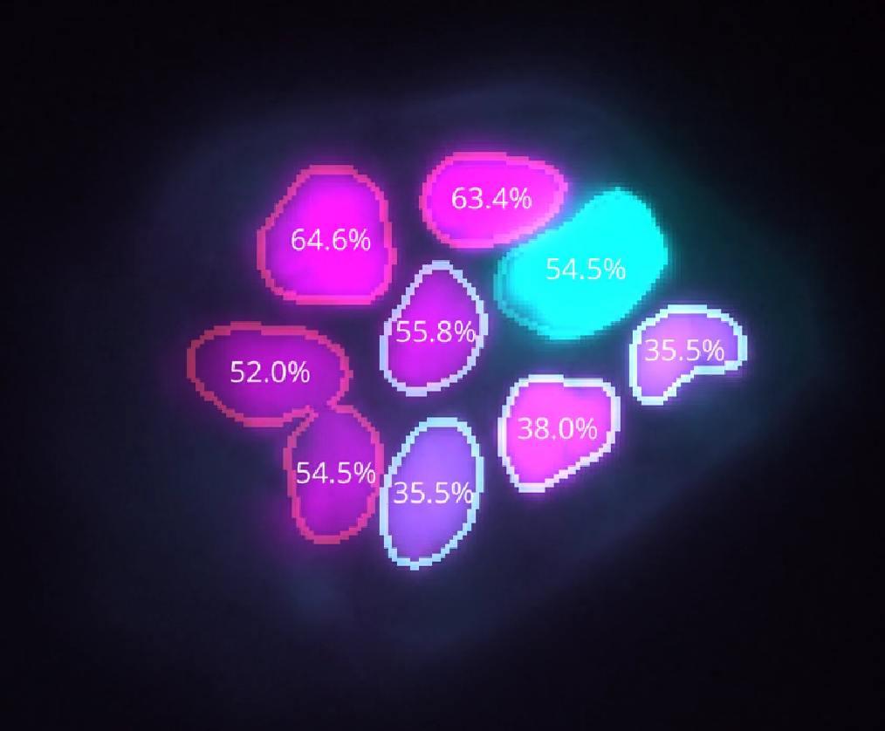

# fucciphase

[](https://github.com/Synthetic-Physiology-Lab/fucciphase/raw/main/LICENSE)
[](https://pypi.org/project/fucciphase)
[](https://python.org)
[](https://github.com/Synthetic-Physiology-Lab/fucciphase/actions/workflows/ci.yml)
[](https://codecov.io/gh/Synthetic-Physiology-Lab/fucciphase)
[](https://results.pre-commit.ci/latest/github/Synthetic-Physiology-Lab/fucciphase/main)

FUCCIphase is open-source software for estimating cell-cycle phase and
cell-cycle percentage from FUCCI fluorescence intensities.
Repository: https://github.com/Synthetic-Physiology-Lab/fucciphase

## Background

**FUCCI** (Fluorescent Ubiquitination-based Cell Cycle Indicator) is a
genetically encoded, dual-colour reporter that makes cell-cycle progression
visible under a fluorescence microscope. One fluorescent protein (typically
shown in **magenta/red**) accumulates during **G1** phase and is degraded at
the G1/S transition, while a second protein (typically shown in **cyan/green**)
accumulates during **S/G2/M** and is degraded after mitosis. The overlap of
both signals marks the **G1/S** transition window.

FUCCIphase takes time-lapse intensity traces — exported from
[TrackMate](https://imagej.net/plugins/trackmate/) or provided as CSV/XLSX —
and:

1. **Normalises** the fluorescence channels,
2. **Classifies** each time point into a discrete cell-cycle phase
   (G1, G1/S, S/G2/M, or mitosis), and
3. **Estimates** a continuous cell-cycle percentage (0–100 %) by aligning each
   track to a reference curve using
   [Dynamic Time Warping (DTW)](https://en.wikipedia.org/wiki/Dynamic_time_warping),
   which accounts for natural variation in phase durations between cells.

## Installation

A virtual environment is recommended. You can install FUCCIphase either from
PyPI or from source.

Install from PyPI:

```bash
pip install fucciphase
```

Install from source:

```bash
git clone https://github.com/Synthetic-Physiology-Lab/fucciphase
cd fucciphase
pip install -e .
```

Optional extras:

```bash
pip install -e ".[jupyter]"
pip install -e ".[napari]"
pip install -e ".[test,dev,doc]"
```

If you only want notebook support without a source install, a minimal setup is:

```bash
pip install fucciphase jupyter matplotlib pandas
```

## Quick CLI start

The smallest runnable example is in
[`examples/cli_quickstart/`](examples/cli_quickstart). It includes:

- a small CSV input table
- the same table as `.xlsx`
- a reference curve
- a sensor JSON file
- an expected processed output table

Run the CSV example from the repository root:

```bash
fucciphase examples/cli_quickstart/tiny_tracks.csv \
    -ref examples/cli_quickstart/tiny_reference.csv \
    --sensor_file examples/cli_quickstart/tiny_sensor.json \
    -dt 0.48 \
    -m MEAN_INTENSITY_CH4 \
    -c MEAN_INTENSITY_CH3
```

This writes:

```text
outputs/tiny_tracks_processed.csv
```

Compare the generated table against:

```text
examples/cli_quickstart/tiny_tracks_expected_output.csv
```

The same workflow also works with:

```text
examples/cli_quickstart/tiny_tracks.xlsx
```

## Full TrackMate workflow

For a larger end-to-end example based on TrackMate XML and Napari visualization,
see [`examples/reproducibility/`](examples/reproducibility).

That workflow uses:

- `inputs/merged_linked.ome.xml`
- `inputs/hacat_fucciphase_reference.csv`
- `inputs/downscaled_hacat.ome.tif`

Run it from `examples/reproducibility/`:

```bash
fucciphase inputs/merged_linked.ome.xml \
    -ref inputs/hacat_fucciphase_reference.csv \
    -dt 0.25 \
    -m MEAN_INTENSITY_CH1 \
    -c MEAN_INTENSITY_CH2 \
    --generate_unique_tracks
```

This generates:

```text
outputs/merged_linked.ome_processed.csv
outputs/merged_linked.ome_processed.xml
```

Visualize the result in Napari:

```bash
fucciphase-napari outputs/merged_linked.ome_processed.csv \
    inputs/downscaled_hacat.ome.tif \
    -m 0 -c 1 -s 2 --pixel_size 0.544
```

Preview media are committed in the repository, while the processed CSV/XML files
are generated when you run the walkthrough.

[](examples/reproducibility/outputs/video_downscaled_hacat.mp4)

## Python API

Use `process_trackmate` for TrackMate XML:

```python
from fucciphase import process_trackmate
from fucciphase.sensor import FUCCISASensor

sensor = FUCCISASensor(
    phase_percentages=[33.3, 33.3, 33.4],
    center=[20.0, 55.0, 70.0, 95.0],
    sigma=[5.0, 5.0, 10.0, 1.0],
)

df = process_trackmate(
    "path/to/trackmate.xml",
    channels=["MEAN_INTENSITY_CH1", "MEAN_INTENSITY_CH2"],
    sensor=sensor,
    thresholds=[0.1, 0.1],
)
print(df[["TRACK_ID", "CELL_CYCLE_PERC_DTW"]].head())
```

Use `process_dataframe` for tabular CSV/XLSX data that you have already loaded
into a pandas DataFrame.

## What's inside this repository

The repository is organized so you can start with a minimal example, move to a
full reproducibility workflow, and then explore notebooks or your own data.

### Main example and data folders

- [`examples/cli_quickstart/`](examples/cli_quickstart): smallest CLI example with CSV/XLSX input, reference data, sensor parameters, and an expected output table
- [`examples/reproducibility/`](examples/reproducibility): TrackMate XML workflow plus Napari visualization and preview media
- [`examples/notebooks/`](examples/notebooks): Jupyter notebooks for calibration, reconstruction, simulation, and figure generation
- [`examples/example_data/`](examples/example_data): reference curves and saved sensor JSON files for calibration and testing

### Selected notebooks

| Notebook | Purpose |
| --- | --- |
| `getting_started.ipynb` | Minimal end-to-end usage example |
| `extract_calibration_data.ipynb` | Build reference curves from movies and TrackMate XML |
| `sensor_calibration.ipynb` | Build or inspect FUCCI sensor models |
| `example_estimated.ipynb` | Explore processed output tables |
| `percentage_reconstruction.ipynb` | Smooth and reconstruct phase-percentage trajectories |
| `example_reconstruction.ipynb` | Recover incomplete or noisy fluorescence traces |
| `example_simulated.ipynb` | Generate synthetic FUCCI signals for testing |
| `signal_mode_comparison.ipynb` | Compare alternative signal modes for DTW-based phase alignment |
| `color-tails-by-percentage.ipynb` | Visualize population-level phase composition |
| `explanation-dtw-alignment.ipynb` | Explain the DTW alignment used internally |
| `phaselocking-workflow-lazy.ipynb` | Scalable phase-locking workflow for larger datasets |

For notebook-specific notes, see
[`examples/notebooks/README.md`](examples/notebooks/README.md). For a higher
level guide to the example folders, see [`examples/README.md`](examples/README.md).

### Source, tests, and docs

- [`src/fucciphase/`](src/fucciphase): library code and CLI entry points
- [`tests/`](tests): automated test suite
- [`doc/`](doc): Sphinx documentation sources

## Using your own data

To process your own dataset:

1. Export tracking from Fiji/TrackMate as `.xml`, or provide a tabular
   `.csv`/`.xlsx` file that can be loaded into a pandas DataFrame.
2. Build a reference CSV or XLSX file containing at least one full cell cycle.
   The expected columns are:

   ```text
   percentage,time,cyan,magenta
   ```

   For examples, see the files in [`examples/example_data/`](examples/example_data).
3. Run FUCCIphase:

   ```bash
   fucciphase your_tracks.xml -ref your_reference.csv -dt <your_timestep> -m <magenta_channel> -c <cyan_channel>
   ```

4. If you have an OME-TIFF video and segmentation masks, visualize the result:

   ```bash
   fucciphase-napari your_tracks_processed.csv your_video.ome.tif -m <magenta_index> -c <cyan_index> -s <mask_index>
   ```

Runtime depends on data size. Standard processing usually runs comfortably on a
typical workstation, while Napari visualization may require more RAM to load
larger videos.

## Development

```bash
git clone https://github.com/Synthetic-Physiology-Lab/fucciphase
cd fucciphase
pip install -e ".[test,dev,doc]"
pre-commit install
```

## Cite us

Di Sante, M., Pezzotti, M., Zimmermann, J., Enrico, A., Deschamps, J., Balmas, E.,
Becca, S., Solito, S., Reali, A., Bertero, A., Jug, F. and Pasqualini, F.S., 2025.
CALIPERS: Cell cycle-aware live imaging for phenotyping experiments and regeneration studies.
bioRxiv, https://doi.org/10.1101/2024.12.19.629259
